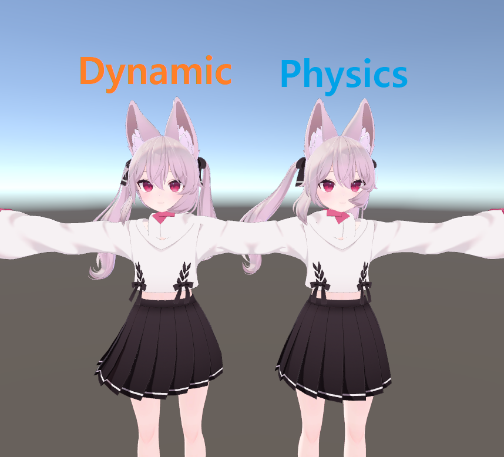
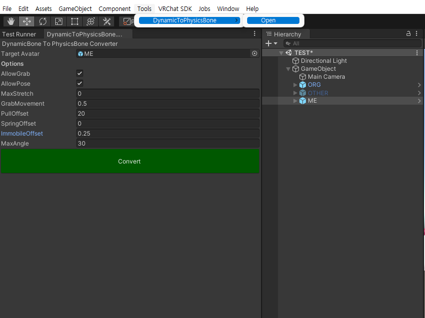

# vrc-dbone-to-pbone-converter
  
Convert Dynamicbone to Physicsbones(VRC SDK)   

## Project requirements
- Project version Unity 2019.4.31f1
- Imported Dynamicbone
- Imported VRC SDK (beta version, included PhysicsBone dll) 

## Result
  
This converting tool doesn't convert the figures perfectly.  
It provides SpringOffset, PullOffset, etc., but it is a comprehensive option.  
In order to finally get the desired result, it is recommended to adjust the PhysicsBone directly after conversion.  

## Quickstart
1. Open [DynamicToPhysicsBone.unitypackage](https://github.com/mousedoc/vrc-dbone-to-pbone-converter/releases/tag/1.0.0)
1. Click menu in Tools/DynamicToPhysicBone/Open
1. Insert your avatars's copy in Target Avatar  
1. Adjust some options  
1. Click Convert button  

## Contribution
Contributions are always welcome.
Create [Issue](https://github.com/mousedoc/vrc-dbone-to-pbone-converter/issues) or [Pull Request](https://github.com/mousedoc/vrc-dbone-to-pbone-converter/pulls).

## References
Customized this [Bone Converter Dtp Converter](https://ranchino.booth.pm/items/3701802)
> Thanx for [JWS7634](https://github.com/JWS7634) & [Ranchino-git](https://github.com/Ranchino-git)
