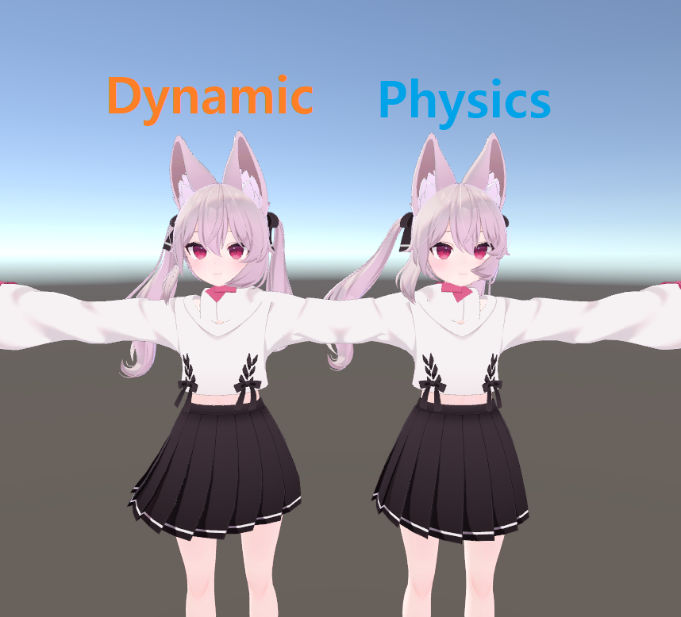
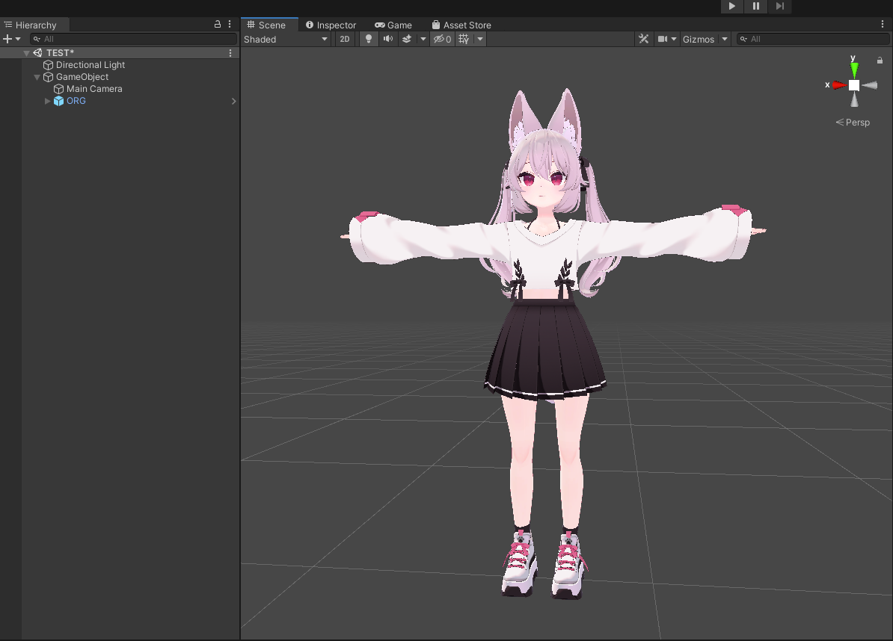

# vrc-dbone-to-pbone-converter
  
Dynamicbone 아바타를 Physicsbones 아바타로 변경

## 필수 요구 사항
- 2019.4.31f1 버전의 유니티 프로젝트
- Dynamicbone 애셋이 이미 임포트되어 있어야 함
- VRC SDK가 이미 임포트되어 있어야 함 (피직스본 관련 기능이 포함된 SDK) 

## 결과
  
이 컨버팅 툴은 수치를 완벽하게 옮겨주지 않습니다.
SpringOffset, PullOffset 등의 조정할 수 있는 기능이 있지만 포괄적인 옵션입니다.
원하는 결과를 얻기 위해, 변환 후 VRCPhsycBone에 대한 새부적인 조정이 필요합니다.

## 빠른 시작
1. [DynamicToPhysicsBone.unitypackage](https://github.com/mousedoc/vrc-dbone-to-pbone-converter/releases/tag/1.0.0) 를 연다
1. Tools/DynamicToPhysicBone/Open 메뉴 클릭
1. 자신의 복사된 아바타를 'Target Avatar'에 추가  
1. SpringOffset, PullOffset 등의 옵션 조정
1. Convert 버튼 클릭

## 참
Customized this [Bone Converter Dtp Converter](https://ranchino.booth.pm/items/3701802)
> Thanx for [JWS7634](https://github.com/JWS7634) & [Ranchino-git](https://github.com/Ranchino-git)
